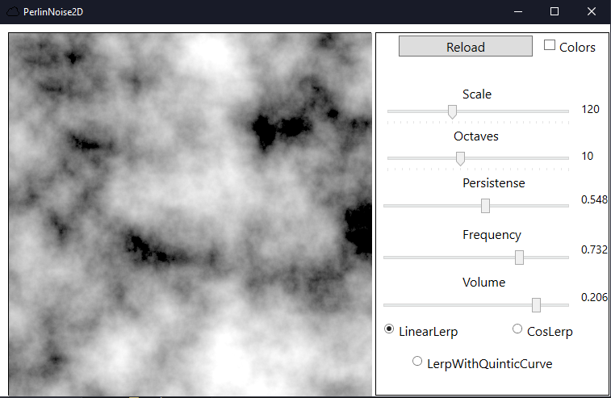
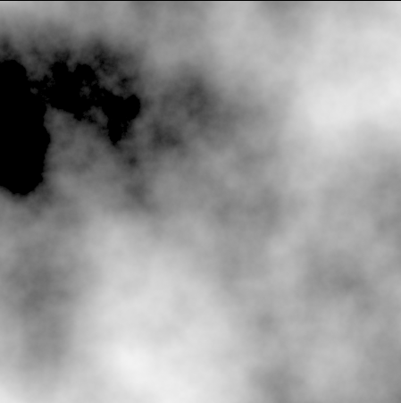

# Procedural-Generaion
This repository contains an implementation of generation Perlin Noise.

## RUS:

Этот репозиторий содержит реализацию генерации шумов Перлина, которые часто применяются в процедурной генерации.
Приложение позволяет увидеть визуализацию шумов Перлина, а также изменить их природу, редактируя переменные функции (масштаб, количество октав, стойкость и частоту).

## Интерфейс и описание работы

* Кнопка "Reload" позволяет сгенерировать новое изображение шума. 

* "Scale" - отвечает за масштаб (приближение) изображения.

* "Octaves" - отвечает за количество октав. Чем больше это свойство, тем выше качество сгенерированного шума, больше "шероховатостей". Работает путём сложения низкочастотных и высокочастотных шумов. Пример шума c 25 октавами:

* "Persistense" - чем выше значение стойкости (persistense), тем быстрее падает амплитуда функции шума. Шум становится более "резким" и "разреженным".

* "Frequency" - практически то же самое что и масштаб. Чем меньше свойство, тем больше "облака" шума.

* Чекбокс "Colors" - к отдельным пикселям, в зависимости от уровня шума в пикселе, также применяются цвета (получается некое подобие карты мира):

## Post Scriptum

Приложение написано в рамках любительского интереса, и автор не претендует на правильность своих суждений в документации.

Большая часть кода с некоторыми изменениями была взята с этой статьи: https://habr.com/ru/post/265775/
  Также руководствовался этой статьей: https://habr.com/ru/post/142592/
